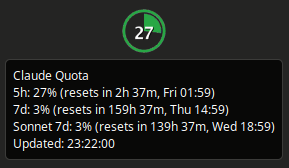
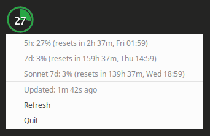

# claude-quota

> **Warning:** This tool uses Claude Code's OAuth client ID to access your
> quota data via an undocumented API. This is not sanctioned by Anthropic
> and may violate the Terms of Service. Use at your own risk.

Systray widget that displays Claude API quota utilization.

Reads OAuth credentials from Claude Code CLI (`~/.claude/.credentials.json`),
polls the Anthropic usage API, and renders a color-coded pie chart icon
with live quota percentages.

|         Systray icon          |              Hover tooltip              |             Context menu              |
| :---------------------------: | :-------------------------------------: | :-----------------------------------: |
|  |  |  |

## Features

- 5-hour, 7-day, and Sonnet 7-day quota tracking
- Color-coded icon: green (<60%), yellow (60-85%), red (>85%)
- Configurable icon size for HiDPI displays
- Reloads OAuth token from disk when expired (relies on `claude login`)
- Self-update from GitHub releases (`-update`)
- Cross-platform: Linux, Windows, macOS

## Prerequisites

Authenticate Claude Code first:

```bash
claude login
```

## Install from release

Download the latest binary for your platform from
[Releases](https://github.com/babs/claude-quota/releases), then run it.

## Build from source

Requires Go 1.24+.

```bash
go build -o claude-quota .
```

For a release build with version info and cross-compilation:

```bash
./release.sh
```

## Usage

```bash
./claude-quota                  # start the systray widget
./claude-quota -version         # show version info
./claude-quota -update          # self-update to latest release
./claude-quota -poll-interval 60
./claude-quota -font-size 24
./claude-quota -icon-size 128   # for HiDPI / large systray panels
```

Click the systray icon to see the quota breakdown with reset times.

## Configuration

Optional. First run creates `~/.config/claude-quota/config.json`:

```json
{
  "poll_interval_seconds": 300,
  "font_size": 18,
  "icon_size": 64,
  "thresholds": {
    "warning": 60,
    "critical": 85
  }
}
```

| Setting                 | Config key              | Env var                      | CLI flag         | Default |
| ----------------------- | ----------------------- | ---------------------------- | ---------------- | ------- |
| Poll interval (seconds) | `poll_interval_seconds` | `CLAUDE_QUOTA_POLL_INTERVAL` | `-poll-interval` | `300`   |
| Font size (px)          | `font_size`             | `CLAUDE_QUOTA_FONT_SIZE`     | `-font-size`     | `18`    |
| Icon size (px)          | `icon_size`             | `CLAUDE_QUOTA_ICON_SIZE`     | `-icon-size`     | `64`    |
| Warning threshold (%)   | `thresholds.warning`    | —                            | —                | `60`    |
| Critical threshold (%)  | `thresholds.critical`   | —                            | —                | `85`    |

Priority: CLI flag > environment variable > config file.

## Autostart (Linux)

Create `~/.config/autostart/claude-quota.desktop`:

```ini
[Desktop Entry]
Type=Application
Name=Claude Quota Widget
Exec=/path/to/claude-quota
Hidden=false
NoDisplay=false
X-GNOME-Autostart-enabled=true
StartupNotify=false
Terminal=false
```

## How it works

The widget uses Claude Code's OAuth credentials to call
`api.anthropic.com/api/oauth/usage`. When the token expires, it is
reloaded from disk in case Claude Code has refreshed it externally.
If the token is still expired, an amber warning icon is shown — run
`claude login` to re-authenticate.

## License

MIT
