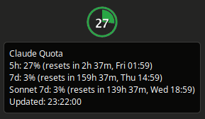
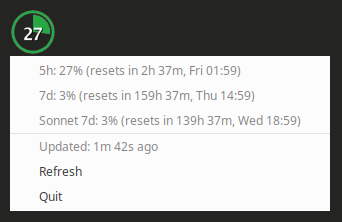

# claude-quota

> **Warning:** This tool uses Claude Code's OAuth client ID to access your
> quota data via an undocumented API. This is not sanctioned by Anthropic
> and may violate the Terms of Service. Use at your own risk.

Systray widget that displays Claude API quota utilization.

Reads OAuth credentials from Claude Code CLI (`~/.claude/.credentials.json`),
polls the Anthropic usage API, and renders a color-coded icon
with live quota percentages. Multiple indicator styles available.

|         Systray icon          |              Hover tooltip              |             Context menu              |
| :---------------------------: | :-------------------------------------: | :-----------------------------------: |
|  |  |  |

## Features

- 5-hour, 7-day, and Sonnet 7-day quota tracking
- Color-coded icon: green (<60%), yellow (60-85%), red (>85%)
- Multiple indicator styles: pie chart, bar, arc, bar with projection
- Burn-rate projection: estimates 5h utilization at window reset
- Optional text overlay toggle (`show_text`)
- Configurable icon size for HiDPI displays
- Reloads OAuth token from disk when expired (relies on `claude login`)
- Self-update from GitHub releases (`-update`)
- Cross-platform: Linux, Windows, macOS

## Prerequisites

- Authenticate Claude Code first: `claude login`
- `curl` and `xz` must be available (the install script checks for both)

## Install from release

Download the latest binary for your platform from
[Releases](https://github.com/babs/claude-quota/releases), then run it.

## One-liner install (macOS & Linux)

Downloads the latest release, installs the binary, and configures autostart.

- **macOS**: installs to `/usr/local/bin`, registers a LaunchAgent (`~/Library/LaunchAgents/com.claude-quota.plist`)
- **Linux**: installs to `~/.local/share/claude-quota/`, creates a desktop entry in `~/.local/share/applications/` and symlinks it to `~/.config/autostart/`

```bash
curl -fsSL \
  https://raw.githubusercontent.com/babs/claude-quota/master/scripts/install.sh \
  | bash
```

Any extra flags are persisted in the startup configuration (LaunchAgent plist on macOS, `.desktop` entry on Linux):

```bash
curl -fsSL \
  https://raw.githubusercontent.com/babs/claude-quota/master/scripts/install.sh \
  | bash -s -- -stats -indicator bar-proj
```

Install without configuring autostart (binary only, user manages startup manually):

```bash
curl -fsSL \
  https://raw.githubusercontent.com/babs/claude-quota/master/scripts/install.sh \
  | bash -s -- --no-autostart
```

To uninstall:

```bash
curl -fsSL \
  https://raw.githubusercontent.com/babs/claude-quota/master/scripts/install.sh \
  | bash -s -- --uninstall
```

## Build from source

Requires Go 1.24+.

```bash
go build -o claude-quota .
```

For a release build with version info and cross-compilation:

```bash
./release.sh
```

## Usage

```bash
./claude-quota                  # start the systray widget
./claude-quota -version         # show version info
./claude-quota -update          # self-update to latest release
./claude-quota -poll-interval 60
./claude-quota -font-size 24
./claude-quota -font-name bitmap  # pixel-crisp bitmap font
./claude-quota -icon-size 128     # for HiDPI / large systray panels
./claude-quota -indicator bar     # vertical bar indicator
./claude-quota -indicator arc     # progress ring indicator
./claude-quota -indicator bar-proj # side-by-side bar with burn-rate projection
./claude-quota -show-text=false   # hide percentage text on icon
./claude-quota -show-account      # show account email/org in menu
./claude-quota -stats             # enable local stats collection
```

Click the systray icon to see the quota breakdown with reset times.

## Configuration

Optional. First run creates `~/.config/claude-quota/config.json`:

```json
{
  "poll_interval_seconds": 300,
  "font_size": 34,
  "font_name": "bold",
  "halo_size": 2,
  "icon_size": 64,
  "indicator": "pie",
  "show_text": true,
  "show_account": false,
  "thresholds": {
    "warning": 60,
    "critical": 85
  }
}
```

| Setting                 | Config key              | Env var                           | CLI flag              | Default  |
| ----------------------- | ----------------------- | --------------------------------- | --------------------- | -------- |
| Claude home dir         | `claude_home`           | `CLAUDE_QUOTA_CLAUDE_HOME`        | `-claude-home`        | `~`      |
| Poll interval (seconds) | `poll_interval_seconds` | `CLAUDE_QUOTA_POLL_INTERVAL`      | `-poll-interval`      | `300`    |
| Font size               | `font_size`             | `CLAUDE_QUOTA_FONT_SIZE`          | `-font-size`          | `34`     |
| Font name               | `font_name`             | `CLAUDE_QUOTA_FONT_NAME`          | `-font-name`          | `"bold"` |
| Halo size               | `halo_size`             | `CLAUDE_QUOTA_HALO_SIZE`          | `-halo-size`          | `2`      |
| Icon size (px)          | `icon_size`             | `CLAUDE_QUOTA_ICON_SIZE`          | `-icon-size`          | `64`     |
| Indicator style         | `indicator`             | `CLAUDE_QUOTA_INDICATOR`          | `-indicator`          | `"pie"`  |
| Show text on icon       | `show_text`             | `CLAUDE_QUOTA_SHOW_TEXT`          | `-show-text`          | `true`   |
| Show account in menu    | `show_account`          | `CLAUDE_QUOTA_SHOW_ACCOUNT`       | `-show-account`       | `false`  |
| Local stats collection  | `stats`                 | `CLAUDE_QUOTA_STATS`              | `-stats`              | `false`  |
| Warning threshold (%)   | `thresholds.warning`    | `CLAUDE_QUOTA_WARNING_THRESHOLD`  | `-warning-threshold`  | `60`     |
| Critical threshold (%)  | `thresholds.critical`   | `CLAUDE_QUOTA_CRITICAL_THRESHOLD` | `-critical-threshold` | `85`     |

> **Note:** When enabled, `-stats` stores quota snapshots in a local SQLite database
> for users who want to analyse their consumption over time. Data never leaves the machine.

`font_size` and `halo_size` are relative to the base icon size (64px). They scale
automatically with `icon_size` — e.g. at `icon_size: 128` the rendered font is 2x larger.

Available font names: `bold` (default), `regular`, `mono`, `monobold`, `bitmap`.
TTF fonts (`bold`, `regular`, `mono`, `monobold`) render smooth vector text.
The `bitmap` font uses pixel-scaled 7x13 bitmap rendering for a retro look.

Available indicator styles:

| Style      | Description                                                                                           |
| ---------- | ----------------------------------------------------------------------------------------------------- |
| `pie`      | Pie chart filling clockwise (default)                                                                 |
| `bar`      | Vertical bar filling bottom to top                                                                    |
| `arc`      | Progress ring filling clockwise from 12 o'clock                                                       |
| `bar-proj` | Two side-by-side bars: left = current 5h usage, right = projected usage at window reset (muted color) |

The `bar-proj` indicator extrapolates the average consumption rate over the
elapsed portion of the 5-hour window to estimate utilization at reset. The
projection is also shown in the tooltip and menu for all indicator styles
(e.g. `5h: 33% (resets in 23m, Mon 14:30)` followed by `  - ~36% at reset`
on a separate line). When projected usage exceeds 100%, a saturation time
is shown (e.g. `  - saturates in 1h 15m, Mon 13:15`).

Priority: CLI flag > environment variable > config file.

## Windows + WSL

If Claude Code is installed inside WSL, the credentials live in the WSL
filesystem. Point `claude-quota.exe` to the WSL home directory:

```powershell
claude-quota.exe -claude-home \\wsl$\<distro>\home\<username>
```

Or via environment variable:

```powershell
set CLAUDE_QUOTA_CLAUDE_HOME=\\wsl$\<distro>\home\<username>
claude-quota.exe
```

Replace `<distro>` with your WSL distribution name and `<username>` with your WSL username.
To list available WSL distributions, run `wsl -l -q` in PowerShell or cmd.

## Autostart (Linux)

The install script configures autostart automatically. For manual setup, create
`~/.local/share/applications/claude-quota.desktop`:

```ini
[Desktop Entry]
Type=Application
Name=Claude Quota Widget
Exec=$HOME/.local/share/claude-quota/claude-quota
Icon=$HOME/.local/share/claude-quota/claude-quota.svg
Hidden=false
NoDisplay=false
StartupNotify=false
Terminal=false
```

Then symlink it into autostart:

```bash
ln -sf ~/.local/share/applications/claude-quota.desktop ~/.config/autostart/
```

## How it works

The widget uses Claude Code's OAuth credentials to call
`api.anthropic.com/api/oauth/usage`. When the token expires, it is
reloaded from disk in case Claude Code has refreshed it externally.
If the token is still expired, an amber warning icon is shown — run
`claude login` to re-authenticate.

## License

MIT
